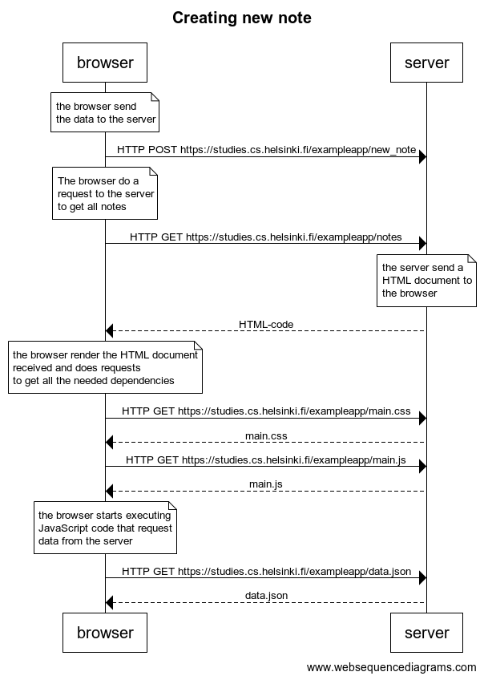

# 0.4 - new note

## Exercise Description

Create a similar diagram depicting the situation where the user creates a new note on the page <https://studies.cs.helsinki.fi/exampleapp/notes> by writing something into the text field and clicking the Save button.

If necessary, show operations on the browser or on the server as comments on the diagram.

The diagram does not have to be a sequence diagram. Any sensible way of presenting the events is fine.

All necessary information for doing this, and the next two exercises, can be found in the text of this part. The idea of these exercises is to read the text once more and to think through what is going on there. Reading the application code is not necessary, but it is of course possible.

You can do the diagrams with any program, but perhaps the easiest and the best way to do diagrams is the Mermaid syntax that is now implemented in GitHub Markdown pages!

## Resolution

Code to generate diagram:

```text
title Creating new note

note over browser:
when user creates a new note,
the browser send the data to the server
end note

browser->server: HTTP POST https://studies.cs.helsinki.fi/exampleapp/new_note

note over browser:
The browser do a request to the 
server to get all notes
end note

browser->server: HTTP GET https://studies.cs.helsinki.fi/exampleapp/notes

note over server:
the server send a HTML document
to the browser
end note

server-->browser: HTML-code

note over browser:
the browser render the HTML document
received and does requests 
to get all the needed dependencies
end note

browser->server: HTTP GET https://studies.cs.helsinki.fi/exampleapp/main.css
server-->browser: main.css
browser->server: HTTP GET https://studies.cs.helsinki.fi/exampleapp/main.js
server-->browser: main.js
browser->server: HTTP GET https://studies.cs.helsinki.fi/exampleapp/data.json
server-->browser: data.json

note over browser:
finally, the browser execute
the JavaScript code and render
the information to the user
end note
```


