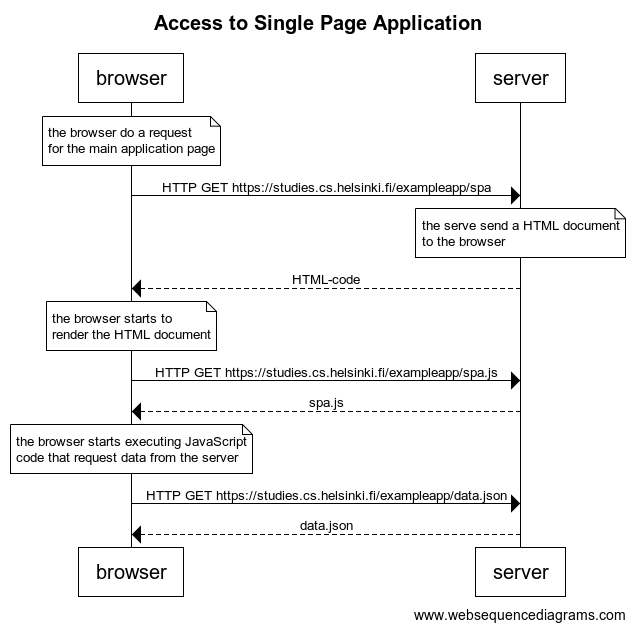

# 0.5 - SPA

## Exercise Description

Create a diagram depicting the situation where the user goes to the single-page app version of the notes app at <https://studies.cs.helsinki.fi/exampleapp/spa>.

## Resolution

Code to generate diagram:

```text
title Access to Single Page Application

note over browser:
the browser do a request
for the main application page
end note

browser->server: HTTP GET https://studies.cs.helsinki.fi/exampleapp/spa

note over server:
the serve send a HTML document
to the browser
end note

server-->browser: HTML-code

note over browser:
the browser starts to 
render the HTML document
end note

browser->server: HTTP GET https://studies.cs.helsinki.fi/exampleapp/spa.js
server-->browser: spa.js

note over browser:
the browser starts executing JavaScript
code that request data from the server
end note

browser->server: HTTP GET https://studies.cs.helsinki.fi/exampleapp/data.json

server-->browser: data.json
```

Diagram:


