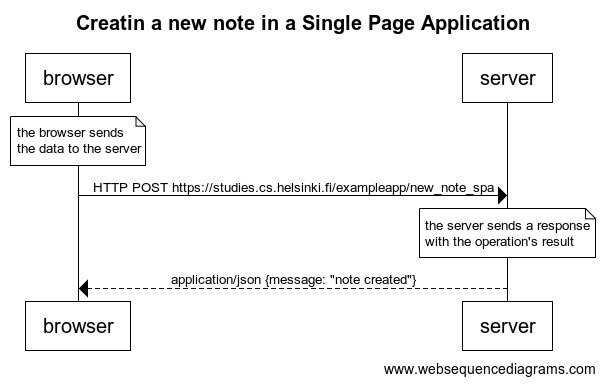

# 0.5 - Creating a new note in a SPA

## Exercise Description

Create a diagram depicting the situation where the user creates a new note using the single-page version of the app.

## Resolution

Code to generate diagram:

```text
title Creatin a new note in a Single Page Application

note over browser:
the browser send 
the data to the server
end note

browser->server: HTTP POST https://studies.cs.helsinki.fi/exampleapp/new_note_spa

note over server:
the server sends a response
with the operation's result
end note

server-->browser: application/json {message: "note created"}
```

Diagram:


